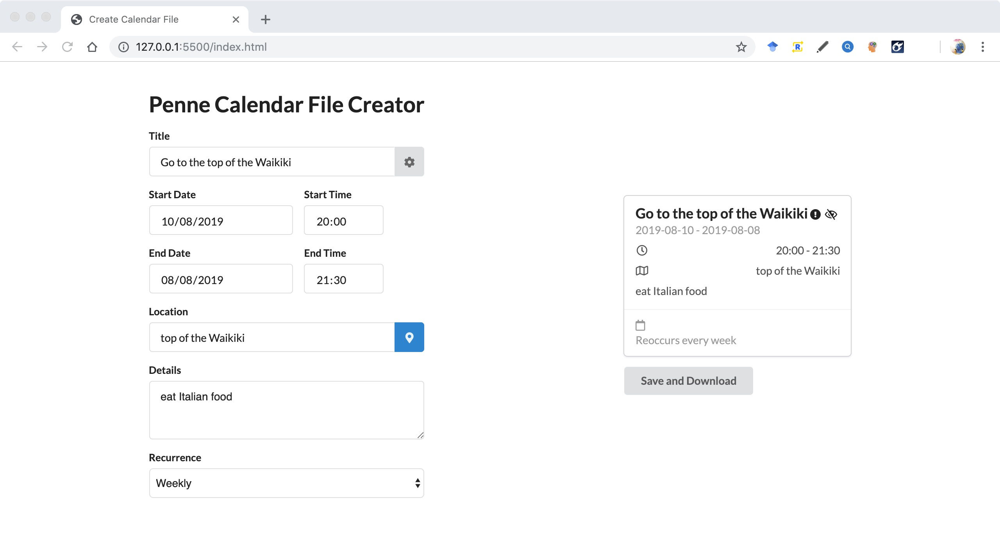
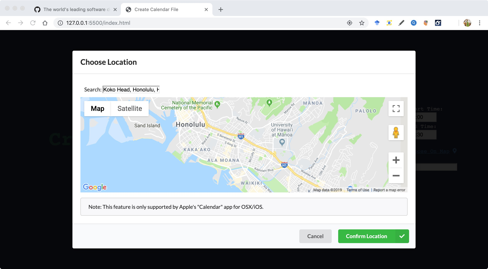

# Team_Penne

# Last delivery

• The URL for a 5 minute video demonstration of your final project. Your demo shall not be longer than five minutes. You can use jing.com, screencast-o- matic.com, ...., or if you are using a Mac, QuickTime, to capture your screen to video. You need to demonstrate the functionality described below.

• A one-page pdf document convincing us that your system is correct. That is, how did you test your system and what were the results?
• A link to your documented source code in your repository.
• Each team member turns in the same pdf document, same link to the repository, and same link to the video demo.

Required functionality. You are developing a stand-alone application to create .ics event files. You must demonstrate the following are implemented:

• Version (section 3.7.4 of RFC 5545)

• Classification (3.8.1.3). Note this is a way of users designating events as
public (default), private, or confidential.
• Geographic Position (3.8.1.6)
• Priority (3.8.1.9)
• Summary (3.8.1.12)

• DTSTART (3.8.2.4)

• DTEND (3.8.2.2)

• Time zone identifier (3.8.3.1)

• And some aspect (your choice) of recurring events (3.8.5). Recurring events
(and exceptions to recurrences) can be very complicated. Start small and do what you can. For example, you might want to start with being able to schedule a meeting on the 25th of every month. Then add the ability to do exceptions, such as “except in December”).

# Fourth check-in

You have performed a usability test on your system with typical users

Case 1: I have asked one of my friends to test our calendar yesterday evening. He is a university student who always used the calendar to plan the events. I asked him to perform a simple task, study in his own campus on Sat morning (10am to 11am), and every week.

He finished the task within 2 mins, and he gives the positive feedback about our calendar, "it's simple and easy to use". I have recorded his comments to our system too.

# Third check-in

You developing and performing test cases as you are developing code
You have functioning code that does more than it did for the first check-in. You must demonstrate a user interface for an event creation system that uses menus and checks input for validity (i.e., no 30 February events, no events that end before they start, ...)
You have a plan for implementing some aspects of recurring events..

# Second check-in

You have functioning code that does something: You must demonstrate code, even if it is just print statements, that generates a .ics file for a simple, single occurrence event: Study for exam, 10am-1pm HST, 13 July 2018, in Hamilton Library. You must then demonstrate that the calendar program of your choice (say, google calendar) successfully reads and processes your .ics file.
You don’t need a user interface for your first check-in since you are just generating the .ics file for the single event described above.

# First Check-in
• your team has registered your project on a project repository system (such
as github).
https://github.com/crisnow/Team_Penne

• everyone in the group has used a calendaring system of their choice to create
an .ics event file and then looked at the content of that file with a text editor
such (such as vim). “Reverse engineering” .ics files can offer significant
insight.

I have google calendar.
